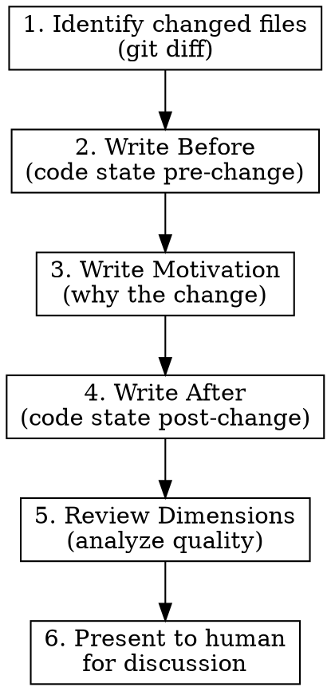

# PR Document

Co-author the PR document (`.github/pull_request_template.md`) with the human. The document describes the code transformation: what existed, why it changed, and what exists now — then evaluates the change across review dimensions.

## Workflow



## Section Guide

### Summary

One sentence: what this PR does. Written last, after all sections are filled.

### Before

Describe the code **as it was** before this branch. Be specific:
- Name the functions, modules, data flows involved
- Link to source with `file:line` references
- Explain how the existing code works, not just that it exists
- Include relevant data shapes or type signatures

**Bad:** "The pipeline had special handling for data functions."
**Good:** "`src/viz/render/rp/block_resolver.cljc:228-234` uses a three-phase pipeline: `inject-data-results` (prewalk) replaces `(exec-sql-query ...)` forms with fetched rows, `substitute-refs` (postwalk) resolves `#ref` tagged literals, then `eval-deep` (postwalk) evaluates SCI expressions."

### Motivation

Why the change is needed. Link to the GitHub issue. Categories:
- Bug: what's broken, reproduction steps
- Feature: what capability is added
- Refactoring: what structural problem is solved
- Tech debt: what maintenance burden is reduced

### After

Describe the code **as it is now**. Mirror the Before section — same functions/modules, showing what changed. For small PRs, inline. For large PRs, link to a separate markdown document in the repo.

### Review Dimensions

Each dimension requires **active investigation**, not just description of what you did.

#### Decomplection Analysis

Examine changed code for interleaved concerns. Use the decomplection-first-design skill if available. Check:
- Does any function mix data transformation with side effects?
- Are "what" and "how" separated? (e.g., resolver declaration vs fetch implementation)
- Are state, identity, and value conflated?

#### Redundancy — Codebase-Wide

**Search the full codebase**, not just changed files:

```
Grep for similar function names, patterns, abstractions
Check if a helper you wrote already exists elsewhere
Identify parallel implementations of the same concept
```

Flag anything that should be consolidated. This is the most commonly skipped section — do not skip it.

#### Code Quality — Bad Patterns

Flag anti-patterns in changed code: mutation where unnecessary, missing error handling at system boundaries, overly complex conditionals, God functions.

#### Alignment — Code, Docs, Mental Model

Check three layers:
- **Project-wide docs**: Does CLAUDE.md, any skill, or analyst doc need updating?
- **PR-wide docs**: Does the After section accurately reflect the code?
- **Executable examples**: Should any new behavior have a Primer-style runnable example?

#### Logic & Correctness

List tests added/modified. Identify coverage gaps worth brainstorming with the human. Check if Claude-facing docs (skills, memory) were updated for new patterns.

#### Visual & UX

For UI changes: attach before/after screenshots or Playwright snapshots. Note anything warranting attention at the next regular visual review cadence.

## Output

Write the filled template to the PR body or to a local file for review. Present each section to the human for discussion before moving to the next — this is a joint activity, not a solo report.
